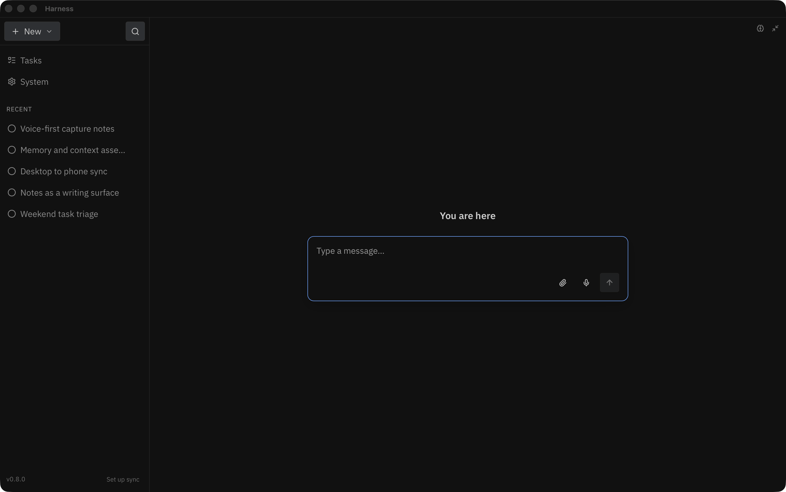

<h1 align="center">Harness</h1>

<p align="center">
  A personal harness around a language model — voice-first, offline, and yours to control from input to output.
</p>

<p align="center">
  <a href="#run">Quick Start</a> ·
  <a href="ROADMAP.md">Roadmap</a> ·
  <a href="BUILD.md">Build</a> ·
  <a href="SECURITY.md">Security</a> ·
  <a href="ios/README.md">iOS</a>
</p>

<p align="center">
  
</p>

---

An LLM harness I built for myself: dictation, chat without the persona, notes, and tasks. Offline-first. Full control over the inputs, the outputs, and everything in between. Commercial tools optimize for a mainstream audience and lock-in — this one is personal, portable, and legible, built to understand agentic systems by making one.

## Principles

- **Personal** — opinionated and unfinished on purpose
- **Portable** — leave, switch models, keep your data
- **Legible** — see context assembly, system prompts, and tools per message
- **Exploratory** — a learning lab, not a product roadmap theater

## Run

```bash
npm install
npm run dev
```

Needs Rust. On macOS, Xcode Command Line Tools for the speech helpers.

```bash
npm run dist:mac          # signed DMG — see BUILD.md
npm run capture:hero      # refresh media/hero.png from a running Harness Dev window
```

`capture:hero` uses macOS `screencapture`. Pass `--launch` to start `npm run dev` if the window isn’t open yet.

## Surfaces

| | |
|---|---|
| **Desktop** | Tauri (Rust + React) — chat, tools, memory, notes, tasks, dictation, R2 sync |
| **Mobile** | Native iOS companion — chat, capture, sync QR pairing ([ios/README.md](ios/README.md)) |
| **Models** | OpenAI API or OpenAI-compatible locals (e.g. Ollama) |
| **Speech** | Apple Speech on macOS and iOS |

## Docs

- [ROADMAP.md](ROADMAP.md) — outcomes and what’s active
- [BUILD.md](BUILD.md) — packaging, signing, Dev vs installed
- [SECURITY.md](SECURITY.md) — trust boundaries and reporting
- [CLAUDE.md](CLAUDE.md) — agent notes (contracts, IPC, radius)
