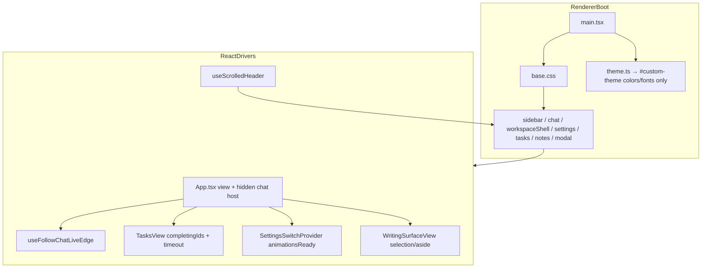
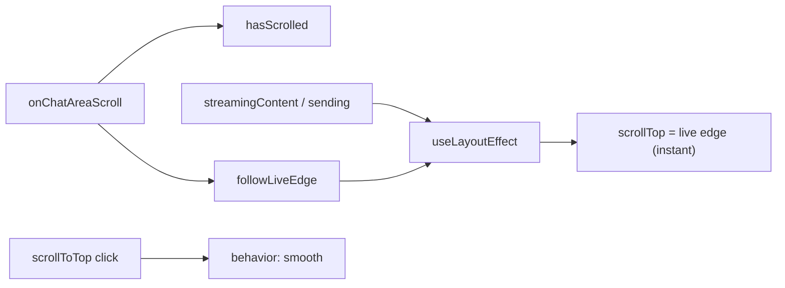
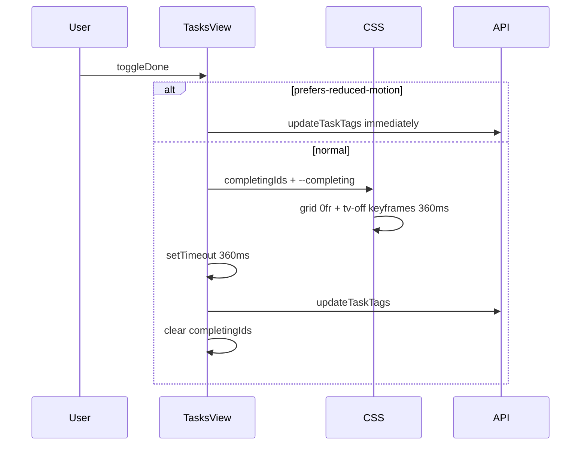

# UI Transition Audit

**Date:** 2026-05-22  
**Scope:** Electron renderer UI/visual transitions (CSS transitions/animations, React-driven show/hide, scroll behavior, `prefers-reduced-motion`).  
**Out of scope:** State/data transitions, navigation/session persistence (`uiSession`), legacy `src/components/*.scss` (not loaded by renderer).

---

## Executive summary

Harness has **no global motion system**. Transitions are defined **per-view in CSS** and triggered by **local React state** (class toggles, `hidden`, conditional mount). A de facto standard of **`0.15s ease`** covers most control hovers; **expressive motion** exists only in notes post-its, task completion (“TV off”), and settings toasts/switches.

**Strengths:** Task completion is the only feature with coordinated CSS + JS timing and dual reduced-motion handling. Settings switches use a solid “hydrate before animate” pattern.

**Gaps:** No motion design tokens; partial `prefers-reduced-motion` coverage; infinite skeleton/spinner loops without overrides; cross-view navigation and modals are instant; several dead or fragile CSS hooks.

---

## 1. Architecture map

### Boot and layering

| Layer | Role | Key files |
|-------|------|-----------|
| **Bootstrap** | Fixed CSS import order; theme injects color/typography vars only | `src/renderer/main.tsx`, `src/shared/theme.ts` |
| **Global CSS** | `.btn` transitions; `.main-chat-host[hidden]` | `src/renderer/base.css` |
| **View CSS** | All substantive `transition` / `animation` / `@keyframes` | `sidebar.css`, `chat.css`, `workspaceShell.css`, `settings.css`, `tasks.css`, `notes.css` |
| **React** | View swap, scroll-follow, completion choreography, switch hydration gate | `App.tsx`, `ChatSurface.tsx`, `chatLiveScroll.ts`, `TasksView.tsx`, `SettingsView.tsx`, `WritingSurfaceView.tsx`, `useScrolledHeader.ts` |
| **Persistence** | `uiSession` stores `view` only — no motion fields | `src/shared/uiSession.ts` |

### Cross-view navigation (no transition coordinator)

| View | Mount strategy | Motion |
|------|----------------|--------|
| **Chat** | Stays mounted when `activeChatProcessing`; `hidden={view !== "chat"}` → `display: none !important` | Instant hide/show |
| **Settings / Tasks / Notes** | Conditional render — unmount when leaving | Instant swap |
| **Chat conversation** | `key={conversationId}` on `ChatView` | Full remount, scroll reset |

---

## 2. CSS transition inventory

Loaded order (`main.tsx`): `base` → `modal` → `sidebar` → `chat` → `workspaceShell` → `settings` → `tasks` → `notes`.

| File | Selector / area | Type | Duration / easing | Reduced motion |
|------|-----------------|------|-------------------|----------------|
| **base.css** | `.btn` | `transition` | `color`, `background`, `box-shadow` — **0.15s ease** | No |
| **sidebar.css** | `.sidebar-list` | `transition` | `max-height`, `opacity` — **0.2s ease** (max-height never toggled) | No |
| **sidebar.css** | `.sidebar-list-expand` | `transition` | `opacity` — **0.15s ease** | No |
| **sidebar.css** | `.sidebar-item-title-skeleton` | `animation` | `sidebar-title-skeleton-pulse` — **1.15s ease-in-out infinite** | No |
| **sidebar.css** | `.sidebar-item-delete` | `transition` | `opacity`, `color`, `background` — **0.15s ease** | No |
| **chat.css** | `.message-user-card__toggle`, `.chat-scroll-top` | `transition` | `opacity` — **0.15s ease** | No |
| **chat.css** | `.message-footer-icon-btn`, `.message-copy-btn`, `.voice-btn` | `transition` | mixed — **0.15s ease** | No |
| **chat.css** | `.chat-pane-title-skeleton` | `animation` | **`sidebar-title-skeleton-pulse`** (defined in sidebar.css) | No |
| **chat.css** | `.voice-spinner` | `animation` | `spin` — **0.9s linear infinite** | No |
| **workspaceShell.css** | `.workspace-header` | `transition` | `border-color`, `box-shadow` — **0.2s ease** | No |
| **tasks.css** | `.tasks-section-caret` | `transition` | `transform` — **0.15s ease** | No |
| **tasks.css** | `.tasks-row-item` | `transition` | `grid-template-rows` — **360ms** custom bezier | Yes (CSS) |
| **tasks.css** | `.tasks-row-item--completing > .tasks-row` | `animation` | `tasks-row-tv-off` — **360ms**; animates `filter` | Yes (CSS) |
| **notes.css** | `.notes-surface__template-btn` | `transition` | `transform`, `box-shadow` — **0.42s** spring beziers | Yes (partial) |
| **notes.css** | `.notes-surface__template-tab` | `transition` | `transform` — **0.42s** | Yes (partial) |
| **notes.css** | `.notes-surface__template-btn:active` | `transition-duration` | **0.12s** override | Yes |
| **notes.css** | `.notes-aside-panel__regen-icon--spinning` | `animation` | `notes-aside-panel-spin` — **0.9s linear infinite** | No |
| **notes.css** | `.notes-surface__note-item:hover` | none | Instant `backdrop-filter` blur on hover | No |
| **settings.css** | `.settings-font-size-stepper__control` | `transition` | **0.15s ease** (mirrors `.btn`) | No |
| **settings.css** | `.settings-switch-track` / thumb | `transition` | **0.22s** ease / spring bezier | Yes |
| **settings.css** | `.settings-switch-row--static` | `transition: none` | Hydration gate | — |
| **settings.css** | `.settings-toast--visible` | `animation` | `toast-in` — **0.2s ease-out** | No |
| **settings.css** | `.settings-playground-theme-preview` | `transition` | **0.12s ease** | No |
| **modal.css** | — | — | **No** transitions (instant open/close) | — |

### Duration / easing taxonomy (no tokens)

| Bucket | Values | Typical use |
|--------|--------|-------------|
| **Fast** | `0.12s` | Post-it active press, theme preview hover |
| **Default** | `0.15s ease` | Buttons, sidebar, chat controls |
| **Medium** | `0.2s ease` | Header border, sidebar list, toast entrance |
| **Switch** | `0.22s` | Settings toggle track/thumb |
| **Expressive** | `0.42s` + bounce beziers | Notes post-it templates |
| **Choreography** | `360ms` + `cubic-bezier(0.55, 0, 0.65, 0.4)` | Task completion |
| **Loading** | `0.9s linear` infinite | Voice spinner, notes regen icon |
| **Skeleton** | `1.15s ease-in-out` infinite | Sidebar + chat title skeleton |

`:root` / `theme.ts` expose **no** `--motion-*` variables.

---

## 3. React-driven transition map

### App shell

| Component | Trigger | State | Visual effect |
|-----------|---------|-------|---------------|
| `App` | View change | `view` | Settings/tasks/notes mount/unmount instantly |
| `App` | Chat processing off-view | `activeChatProcessing` | `.main-chat-host` hidden via `display: none` |
| `ChatView` | Conversation switch | `conversationId` key | Full remount |

### Chat

| Component | Trigger | State | Visual effect |
|-----------|---------|-------|---------------|
| `ChatSurface` | Scroll | `hasScrolled` | `data-scrolled` attribute (**no matching CSS**); conditional `.chat-scroll-top` (opacity transition) |
| `ChatSurface` | Near bottom | `followLiveEdge` | Gates `useFollowChatLiveEdge` |
| `useFollowChatLiveEdge` | Stream / send | `sending`, `streamingContent`, `messageCount` | **Instant** `scrollTop` jump each layout pass |
| `ChatSurface` | Scroll-to-top click | — | `behavior: "smooth"` (only smooth scroll in chat) |
| `ChatSurface` | Composer resize | `ResizeObserver` | `--chat-composer-dock-height` (default 140px until measured) |
| `ChatMessageList` | Expand user card | `expandedUserCards` | Class toggle — **no height transition** |
| `Modal` | Title edit | `open` | Binary mount — no backdrop fade |

### Sidebar

| Component | Trigger | State | Visual effect |
|-----------|---------|-------|---------------|
| `Sidebar` | Search | `searchOpen` | Instant header/list swap |
| `Sidebar` | Title pending | `titleGenInFlight` | Skeleton pulse / spinner |
| CSS | Hover fine pointer | — | Delete button + expand row opacity fade |

### Tasks

| Component | Trigger | State | Visual effect |
|-----------|---------|-------|---------------|
| `TasksView` | Section toggle | `activeOpen`, `completedOpen` | Caret `transform` **0.15s**; panel `hidden={!open}` **instant** |
| `TasksView` | Mark done | `completingIds` + `setTimeout(360)` | `tasks-row-item--completing` grid + keyframes |
| `TasksView` | Reduced motion | `matchMedia` | Skip timeout; immediate tag update |
| `useScrolledHeader` | `scrollTop > 12` | `headerScrolled` | `workspace-header--scrolled` border transition |

### Notes

| Component | Trigger | State | Visual effect |
|-----------|---------|-------|---------------|
| `WritingSurfaceView` | List ↔ detail | `screen` | Class `notes-surface__scroll--detail`; `overflow: hidden` — instant layout |
| `WritingSurfaceView` | Selection | `selection`, `editorFocused`, `asideExpanded` | Toolbar / aside / overlay visibility |
| `WritingSurfaceView` | Editor scroll | `editorScrollTop` | Overlay `translate` sync |
| CSS | Post-it hover | — | Transform transition (reduced-motion override) |

### Settings

| Component | Trigger | State | Visual effect |
|-----------|---------|-------|---------------|
| `SettingsView` | After `settings.get()` | `switchAnimationsReady` | Double `rAF`; removes `settings-switch-row--static` |
| `SettingsView` | Autosave | `saveStatus` | `settings-toast--visible` + `toast-in`; hide is instant |
| `SettingsView` | Tab change | `activeTab` | Panel swap + `scrollTo({ top: 0, behavior: "auto" })` |
| `SettingsView` | Header scroll | `headerScrolled` | `settings-tabs--latched` — **only sets `opacity: 1`** (inert) |

### Shared scroll chrome

`useScrolledHeader` → `workspace-header--scrolled` in Tasks, Settings, Notes (border **0.2s**).

---

## 4. Prioritized findings

### High

| # | Issue | Evidence | Impact |
|---|-------|----------|--------|
| H1 | **No app-wide reduced-motion policy** | Only 3 CSS files have `@media (prefers-reduced-motion: reduce)`; one JS check in `TasksView` | Users with vestibular sensitivity still get infinite pulses, hovers, toast motion, caret rotation |
| H2 | **Infinite decorative animations ungated** | `sidebar-title-skeleton-pulse`, `spin`, `notes-aside-panel-spin` | WCAG 2.2.2 (Pause, Stop, Hide) risk for looping motion |
| H3 | **Task completion animates expensive properties** | `grid-template-rows` + `filter` + `scaleY` in `tasks.css` | Jank on long lists; dual transition+animation on same row |
| H4 | **Live-edge scroll runs every stream chunk** | `useFollowChatLiveEdge` in `useLayoutEffect` deps include `streamingContent` | Layout thrashing during long streams; intentional but costly |
| H5 | **Cross-file animation coupling** | `chat.css` uses `sidebar-title-skeleton-pulse` defined in `sidebar.css` | Breaks if `main.tsx` import order changes |

### Medium

| # | Issue | Evidence | Impact |
|---|-------|----------|--------|
| M1 | **Tasks section: animated caret, instant panel** | `hidden={!activeOpen}` vs `.tasks-section-caret--open` transform | Visual mismatch — rotate without content motion |
| M2 | **View switches are abrupt** | `App.tsx` conditional mount + `hidden` chat host | Inconsistent vs rich in-view motion (post-its, TV-off) |
| M3 | **Modals: no enter/exit** | `Modal.tsx` `if (!open) return null` | Hard cuts for task editor, title modal |
| M4 | **Toast: animate in, instant out** | `settings-toast--visible` uses `animation`; hide drops classes | Asymmetric feedback; no reduced-motion |
| M5 | **Notes selection overlay flash risk** | `showSelectionOverlay = hasSelection && !editorFocused` | Blur when moving to toolbar can flash overlay |
| M6 | **Notes list hover: instant backdrop-filter** | `notes.css` note row hover | Expensive paint; no transition or reduced-motion |
| M7 | **Duplicated timing constants** | `TV_OFF_ANIMATION_MS = 360` in TS + `360ms` in CSS | Drift risk if one side changes |
| M8 | **`data-scrolled` unused in CSS** | Set in `ChatSurface.tsx`; no `[data-scrolled]` rules | Dead attribute; scroll-top uses conditional render only |

### Low

| # | Issue | Evidence | Impact |
|---|-------|----------|--------|
| L1 | **Dead `.sidebar-list` max-height transition** | `max-height: 9999px` never toggled from TSX | Vestigial CSS |
| L2 | **`.workspace-header` transitions unused `box-shadow`** | Scrolled modifier only sets `border-bottom-color` | Half of transition never runs |
| L3 | **Duplicate spinner keyframes** | `spin` (chat) vs `notes-aside-panel-spin` (notes) | Maintenance duplication |
| L4 | **`settings-tabs--latched` inert** | Only `opacity: 1`; no contrasting default | Dead or incomplete feature |
| L5 | **Legacy `src/components/*.scss` motion** | `App.scss` margin transition, `Chat.scss` bounce dots | Not loaded by Electron renderer; contributor confusion |
| L6 | **Composer dock default vs measured** | `--chat-composer-dock-height: 140px` until `ResizeObserver` | Possible one-frame padding jump |
| L7 | **Scroll gating duplicated in test** | `shouldScrollToLiveEdge` in `chatLiveScroll.test.ts` | Must stay in sync with hook manually |

---

## 5. Accessibility: `prefers-reduced-motion`

| Location | Coverage |
|----------|----------|
| `tasks.css` | Disables grid transition + TV-off animation; instant opacity |
| `tasks.tsx` | `matchMedia` bypasses 360ms timeout |
| `notes.css` | Disables post-it transitions; reduces hover lift |
| `settings.css` | Disables switch track/thumb transitions |
| **Everything else** | Buttons, sidebar, chat, skeletons, spinners, toasts, carets, modals — **no override** |

**Notable:** `theme.ts` generates no motion-related CSS variables.

---

## 6. Test coverage audit

### Existing renderer tests (transition-adjacent)

| File | Covers | Does not cover |
|------|--------|----------------|
| `chatLiveScroll.test.ts` | `distanceFromLiveEdge`, `scrollScrollContainerToLiveEdge`, mirrored `shouldScrollToLiveEdge` gating | Hook integration, DOM scroll during real streaming, `followLiveEdge` reset on new turn |
| `chatDisplayTitle.test.ts` | `isConversationTitlePending` (skeleton **state**, not CSS) | Skeleton animation, reduced motion |
| `chatTurnFlow.test.ts` | Turn ID staleness | Visual transitions |
| `sidebarUtils.test.ts` | Conversation grouping | Sidebar search swap, hover fades |

### Critical gaps (recommended additions)

1. **Task completion:** `TV_OFF_ANIMATION_MS` alignment; `completingIds` cleanup; reduced-motion branch skips timeout.
2. **Tasks sections:** caret class vs `hidden` panel — document intended UX or add height transition.
3. **`useFollowChatLiveEdge`:** Export gating helper from `chatLiveScroll.ts` (remove duplicated test mirror); test `justStartedTurn` path.
4. **Settings switch hydration:** `settings-switch-row--static` removed after double rAF.
5. **Reduced motion:** CSS presence tests or Playwright with `prefers-reduced-motion: reduce` for tasks/notes/settings.
6. **Notes selection UI:** overlay vs toolbar focus behavior (regression-prone).
7. **Modal mount:** smoke test that open/close does not throw (no animation assertion needed unless added).

---

## 7. Remediation roadmap

### Phase A — Foundation (1–2 days)

1. Add motion tokens to `:root` in `base.css`:
   - `--motion-duration-fast: 150ms`
   - `--motion-duration-normal: 200ms`
   - `--motion-duration-emphasis: 360ms`
   - `--motion-ease-standard: ease`
   - `--motion-ease-emphasis: cubic-bezier(0.55, 0, 0.65, 0.4)`
2. Add **targeted** global reduced-motion block in `base.css` (avoid blanket `!important` on everything unless reviewed):
   - Disable infinite animations (skeleton, spinners) under `prefers-reduced-motion: reduce`
   - Set decorative transitions to `none` or near-instant
3. Move shared `@keyframes` (`skeleton-pulse`, `spin`) into `base.css` or `motion.css` imported early — remove cross-file name dependency.

### Phase B — Consistency (2–3 days)

4. Replace hardcoded `0.15s` / `0.2s` in view CSS with `var(--motion-*)` (start with `base.css` `.btn`, `sidebar.css`, `chat.css`).
5. Centralize task timing: `src/shared/motion.ts` exporting `TASK_COMPLETE_MS = 360`; set CSS custom property on `.tasks-page` from TS or build step.
6. Gate infinite loaders: static opacity under reduced motion for skeletons and spinners.
7. Fix or remove dead rules: `.sidebar-list` max-height transition, `data-scrolled` (wire CSS or remove attr), `settings-tabs--latched`.

### Phase C — UX polish (optional, 2–4 days)

8. **`usePrefersReducedMotion()`** hook — generalize `TasksView` pattern for future JS choreography.
9. **Tasks sections:** either animate panel height (`grid-template-rows` / `details`) or drop caret transition for honesty.
10. **Modal:** optional backdrop `opacity` transition with reduced-motion instant path.
11. **Toast:** symmetric fade-out or instant both ways under reduced motion.
12. **View transitions:** light cross-fade on `.main` children if product wants parity with in-view motion; keep chat `hidden` behavior for streaming.

### Phase D — Hygiene

13. Document `SettingsSwitchProvider` + double-rAF as standard for async-loaded toggles.
14. Mark `src/components/*.scss` as legacy in README or remove if unused.
15. Export `shouldScrollToLiveEdge` from `chatLiveScroll.ts` and delete duplicate in test file.

---

## 8. Quick reference diagrams

### Chat scroll flow

### Task completion flow

---

## Appendix: legacy / unused motion

These files define transitions but are **not** imported by `src/renderer/main.tsx`:

- `src/components/App.scss` — `margin-left 0.3s ease`
- `src/components/Sidebar.scss` — `transform 0.3s ease`
- `src/components/Chat.scss` — typing `bounce` animation
- `src/components/Toast.scss` — `fadeIn 0.3s`

Treat as deprecated unless a separate build path still uses them.
