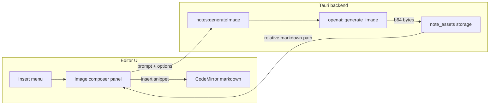

> **Superseded** by [`plans/2026-07-12-image-objects.md`](./2026-07-12-image-objects.md): images are first-class library objects (New menu + canvas view), not note Insert → markdown assets.
>
> Kept for history of the abandoned note-embedded approach.

# Editor Image Generation Implementation Plan

> **For agentic workers:** Implement task-by-task. Steps use checkbox (`- [ ]`) syntax for tracking. Prefer small commits per task group unless the user asks otherwise.
>
> **Source:** Restored from Jul 9, 2026 Cursor plan (`editor_image_generation_7fe5866c`). Filed for handoff on 2026-07-12.

**Goal:** Let users generate OpenAI images from the desktop Notes editor, save them as note-linked assets, and insert markdown at the cursor via an Insert → Image… flow.

**Architecture:** Keep markdown as source of truth. Backend (`openai::generate_image` + `note_assets`) writes bytes under `app-state/note-assets/{noteId}/`, returns a relative markdown snippet. Frontend adds an Insert menu + `NotesImageComposer` panel; CodeMirror gains `insertAtCursor` and a lightweight image-line decoration. Reuse the existing OpenAI keychain credential — renderer never calls OpenAI directly.

**Tech Stack:** Tauri (Rust), React + CodeMirror 6, OpenAI Images API (`gpt-image-1`), Vitest + `cargo test`

**Outcome fit:** O2 (replace paid image tools), O4 (new provider surface + IPC pattern)

---

## Scope

### In scope (v1)

1. Generate images from the Editor using the existing OpenAI API key.
2. Options: aspect → size, quality, background, output format.
3. Content-type-aware chrome: Insert menu + image-aware selection actions.
4. Assets sync via existing recursive `app-state/` bundle (no sync changes required).

### Out of scope (v1)

- iOS notes editor / image UI
- Image edit / inpainting (`images/edit`)
- Chat assistant `generate_image` tool
- Migrating notes to folder-per-note layout
- Orphan GC when markdown refs are deleted (only cleanup on note delete)

---

## File structure

| File | Responsibility | Action |
|------|----------------|--------|
| `src/shared/noteImageOptions.ts` | Aspect→size map, defaults, UI labels | Create |
| `src/shared/noteImageOptions.test.ts` | Mapping + default tests | Create |
| `src/shared/writing.ts` | `NoteImageGenerateInput` / `Result` + image-markdown regex helper | Modify |
| `src/shared/openaiModels.ts` | `OPENAI_IMAGE_MODEL` constant | Modify |
| `src/shared/desktopAPI.ts` | `notes.generateImage` | Modify |
| `src/shared/ipcNames.test.ts` | `notes:generateImage` → `notes_generate_image` | Modify |
| `src/renderer/desktopAdapter.ts` | Invoke wiring | Modify |
| `src-tauri/src/openai.rs` | `openai_image_model`, `ImageGenerateOptions`, `generate_image` | Modify |
| `src-tauri/src/note_assets.rs` | Save / resolve / delete note assets | Create |
| `src-tauri/src/notes.rs` | `generate_note_image`; call asset cleanup from `delete_note` | Modify |
| `src-tauri/src/commands.rs` | `notes_generate_image` command | Modify |
| `src-tauri/src/lib.rs` | Register module + command | Modify |
| `src/renderer/NotesImageComposer.tsx` | Prompt + options + preview + insert/regenerate | Create |
| `src/renderer/notesSelectionActions.ts` | Text vs image-line action set | Create |
| `src/renderer/notesSelectionActions.test.ts` | Detection tests | Create |
| `src/renderer/WritingSurfaceView.tsx` | Insert menu + composer wiring | Modify |
| `src/renderer/NotesCodeEditor.tsx` | `insertAtCursor` on handle | Modify |
| `src/renderer/notesEditorExtensions.ts` | Image markdown line decoration | Modify |
| `src/renderer/notes.css` | Insert menu + composer styles | Modify |

---

## Content model

- Disk: `app-state/note-assets/{noteId}/{assetId}.{ext}`
- Markdown: ``
- Resolution: for active note `{noteId}`, resolve to `app-state/note-assets/{noteId}/{assetId}.{ext}`
- Do **not** put absolute filesystem paths in markdown

### OpenAI Images API

- `POST https://api.openai.com/v1/images/generations`
- Default model: `gpt-image-1` (env `OPENAI_IMAGE_MODEL`)
- Response: `data[0].b64_json` → decode to bytes (no URL fetch)

| UI control | API field | Values |
|------------|-----------|--------|
| Aspect | `size` | `1024x1024`, `1536x1024`, `1024x1536`, `auto` |
| Quality | `quality` | `low`, `medium`, `high`, `auto` |
| Background | `background` | `opaque`, `transparent`, `auto` |
| Format | `output_format` | `png`, `jpeg`, `webp` |

Gate missing API key the same way as `propose_note_edit` (`"OpenAI API key required."`).

---

## Architecture



---

### Task 1: Shared types + option mapping

**Files:**
- Create: `src/shared/noteImageOptions.ts`
- Create: `src/shared/noteImageOptions.test.ts`
- Modify: `src/shared/writing.ts`
- Modify: `src/shared/openaiModels.ts`

- [ ] **Step 1: Add model constant**

In `openaiModels.ts`, add:

```ts
/** OpenAI Images API default (override with OPENAI_IMAGE_MODEL on the Rust side). */
export const OPENAI_IMAGE_MODEL = "gpt-image-1";
```

- [ ] **Step 2: Add shared types to `writing.ts`**

```ts
export type NoteImageAspect = "auto" | "square" | "landscape" | "portrait";
export type NoteImageQuality = "auto" | "low" | "medium" | "high";
export type NoteImageBackground = "auto" | "opaque" | "transparent";
export type NoteImageOutputFormat = "png" | "jpeg" | "webp";

export interface NoteImageGenerateInput {
  noteId: string;
  prompt: string;
  aspect: NoteImageAspect;
  quality: NoteImageQuality;
  background: NoteImageBackground;
  outputFormat: NoteImageOutputFormat;
  alt?: string;
}

export interface NoteImageGenerateResult {
  assetId: string;
  relativePath: string; // note-assets/{assetId}.png
  markdown: string; // 
  absolutePath: string; // for preview via convertFileSrc
}

/** Matches a full-line markdown image pointing at note-assets/. */
export const NOTE_ASSET_IMAGE_LINE_RE =
  /^!\[[^\]]*\]\(note-assets\/([A-Za-z0-9_-]+)\.(png|jpe?g|webp)\)\s*$/i;

export function parseNoteAssetImageLine(
  line: string
): { assetId: string; ext: string } | null {
  const m = line.trim().match(NOTE_ASSET_IMAGE_LINE_RE);
  if (!m) return null;
  return { assetId: m[1], ext: m[2].toLowerCase() };
}
```

- [ ] **Step 3: Implement `noteImageOptions.ts`**

```ts
import type {
  NoteImageAspect,
  NoteImageBackground,
  NoteImageOutputFormat,
  NoteImageQuality,
} from "./writing";

export const NOTE_IMAGE_DEFAULTS = {
  aspect: "auto" as NoteImageAspect,
  quality: "auto" as NoteImageQuality,
  background: "auto" as NoteImageBackground,
  outputFormat: "png" as NoteImageOutputFormat,
};

export const NOTE_IMAGE_ASPECT_TO_SIZE: Record<NoteImageAspect, string> = {
  auto: "auto",
  square: "1024x1024",
  landscape: "1536x1024",
  portrait: "1024x1536",
};

export function sizeForAspect(aspect: NoteImageAspect): string {
  return NOTE_IMAGE_ASPECT_TO_SIZE[aspect];
}

/** JPEG cannot be transparent — callers should force opaque or switch format. */
export function backgroundAllowedForFormat(
  format: NoteImageOutputFormat,
  background: NoteImageBackground
): NoteImageBackground {
  if (format === "jpeg" && background === "transparent") return "opaque";
  return background;
}
```

Also export label arrays for the UI segments (Aspect / Quality / Background / Format).

- [ ] **Step 4: Write tests**

```ts
// src/shared/noteImageOptions.test.ts
import { describe, expect, it } from "vitest";
import {
  NOTE_IMAGE_DEFAULTS,
  backgroundAllowedForFormat,
  sizeForAspect,
} from "./noteImageOptions";
import { parseNoteAssetImageLine } from "./writing";

describe("noteImageOptions", () => {
  it("maps aspect presets to OpenAI sizes", () => {
    expect(sizeForAspect("square")).toBe("1024x1024");
    expect(sizeForAspect("landscape")).toBe("1536x1024");
    expect(sizeForAspect("portrait")).toBe("1024x1536");
    expect(sizeForAspect("auto")).toBe("auto");
  });

  it("disallows transparent JPEG", () => {
    expect(backgroundAllowedForFormat("jpeg", "transparent")).toBe("opaque");
    expect(backgroundAllowedForFormat("png", "transparent")).toBe("transparent");
  });

  it("has auto defaults", () => {
    expect(NOTE_IMAGE_DEFAULTS.aspect).toBe("auto");
    expect(NOTE_IMAGE_DEFAULTS.outputFormat).toBe("png");
  });
});

describe("parseNoteAssetImageLine", () => {
  it("parses asset lines", () => {
    expect(parseNoteAssetImageLine("")).toEqual({
      assetId: "abc",
      ext: "png",
    });
  });

  it("rejects non-asset images", () => {
    expect(parseNoteAssetImageLine("")).toBeNull();
  });
});
```

- [ ] **Step 5: Run tests**

```bash
npx vitest run src/shared/noteImageOptions.test.ts
```

Expected: PASS

---

### Task 2: Rust OpenAI image generation

**Files:**
- Modify: `src-tauri/src/openai.rs`

- [ ] **Step 1: Add model helper + options + generate_image**

Mirror `chat_completion_json` error handling. Sketch:

```rust
const OPENAI_IMAGES_GENERATIONS_URL: &str = "https://api.openai.com/v1/images/generations";

pub fn openai_image_model() -> String {
    std::env::var("OPENAI_IMAGE_MODEL").unwrap_or_else(|_| "gpt-image-1".into())
}

pub struct ImageGenerateOptions {
    pub size: String,
    pub quality: String,
    pub background: String,
    pub output_format: String,
}

pub async fn generate_image(
    api_key: &str,
    prompt: &str,
    options: &ImageGenerateOptions,
) -> Result<Vec<u8>, OpenAIError> {
    // POST JSON: model, prompt, size, quality, background, output_format, n: 1
    // timeout ~120s (image gen is slow)
    // On success: decode data[0].b64_json with base64 crate (add dependency if missing)
    // On non-2xx: OpenAIError::Api(body)
}
```

- [ ] **Step 2: Unit-test request body shape** (pure helper that builds the JSON `Value`, tested without network) OR a `#[cfg(test)]` fixture asserting fields.

- [ ] **Step 3: `cargo test` for the new unit test**

```bash
cd src-tauri && cargo test openai -- --nocapture
```

---

### Task 3: Note asset storage + delete cleanup

**Files:**
- Create: `src-tauri/src/note_assets.rs`
- Modify: `src-tauri/src/notes.rs` (`delete_note`)
- Modify: `src-tauri/src/lib.rs` (`mod note_assets;`)

- [ ] **Step 1: Implement storage helpers**

```rust
// note_assets.rs
// NOTE_ASSETS_DIR = "note-assets"
// note_assets_dir(app_state, note_id) -> app-state/note-assets/{note_id}
// save_note_asset(note_id, bytes, format) -> { asset_id, relative_path, absolute_path }
//   - uuid filename, create_dir_all, atomic write (temp + rename)
// resolve_note_asset_path(note_id, relative_path) -> Option<PathBuf>
// delete_note_assets_for_note(note_id) -> remove_dir_all if exists
```

Relative path format returned to clients: `note-assets/{assetId}.{ext}` (note id is implied by active note).

- [ ] **Step 2: Hook `delete_note`**

After removing the `.md` file in `delete_note`, call `note_assets::delete_note_assets_for_note(clean_id)`.

- [ ] **Step 3: Add Rust tests** for save path layout + delete removes directory (use temp dir / override via test helper if the codebase has `*In(dir)` patterns; otherwise `tempfile`).

---

### Task 4: `notes:generateImage` IPC end-to-end

**Files:**
- Modify: `src-tauri/src/notes.rs` — `generate_note_image`
- Modify: `src-tauri/src/commands.rs` — `notes_generate_image`
- Modify: `src-tauri/src/lib.rs` — register command
- Modify: `src/shared/desktopAPI.ts`
- Modify: `src/renderer/desktopAdapter.ts`
- Modify: `src/shared/ipcNames.test.ts`

- [ ] **Step 1: Backend orchestration**

```rust
// notes.rs — camelCase serde structs matching NoteImageGenerateInput/Result
pub async fn generate_note_image(input: NoteImageGenerateInput) -> Result<NoteImageGenerateResult, String> {
    let prompt = input.prompt.trim();
    if prompt.is_empty() { return Err("Prompt is required.".into()); }
    let api_key = credentials::resolve_openai_api_key().await.trim().to_string();
    if api_key.is_empty() { return Err("OpenAI API key required.".into()); }
    // map aspect → size (duplicate mapping in Rust or accept size from TS — prefer map in Rust from aspect enum)
    let bytes = openai::generate_image(...).await.map_err(|e| e.to_string())?;
    let saved = note_assets::save_note_asset(&input.note_id, &bytes, &format)?;
    let alt = input.alt.unwrap_or_else(|| truncate_alt(prompt));
    let markdown = format!("", saved.relative_path);
    Ok(NoteImageGenerateResult { ... })
}
```

- [ ] **Step 2: Command**

```rust
#[command(rename_all = "camelCase")]
pub async fn notes_generate_image(input: Value) -> Result<Value, String> {
    // deserialize input, call generate_note_image, serialize result
}
```

Register in `lib.rs` next to other `notes_*` commands.

- [ ] **Step 3: Frontend API**

`desktopAPI.ts`:

```ts
generateImage: (input: NoteImageGenerateInput) => Promise<NoteImageGenerateResult>;
```

`desktopAdapter.ts`:

```ts
generateImage: (input) => invoke(cmd("notes:generateImage"), { input }),
```

- [ ] **Step 4: IPC name test**

```ts
expect(legacyIpcCommand("notes:generateImage")).toBe("notes_generate_image");
```

```bash
npx vitest run src/shared/ipcNames.test.ts
```

---

### Task 5: `insertAtCursor` on NotesCodeEditor

**Files:**
- Modify: `src/renderer/NotesCodeEditor.tsx`

- [ ] **Step 1: Extend handle**

```ts
export interface NotesCodeEditorHandle {
  focus: () => void;
  setSelection: (from: number, to?: number) => void;
  getView: () => EditorView | null;
  insertAtCursor: (text: string) => void;
}
```

Implementation: read `view.state.selection.main.from`, dispatch a change that inserts `text` at cursor (or replaces selection), then place cursor after inserted text. Trigger existing `onChange` path so autosave runs.

---

### Task 6: NotesImageComposer + Insert menu

**Files:**
- Create: `src/renderer/NotesImageComposer.tsx`
- Modify: `src/renderer/WritingSurfaceView.tsx`
- Modify: `src/renderer/notes.css`

- [ ] **Step 1: Build composer UI**

Props sketch:

```ts
type NotesImageComposerProps = {
  noteId: string;
  open: boolean;
  position: { top: number; left: number; width: number };
  onClose: () => void;
  onInsert: (markdown: string) => void;
};
```

Behavior:
- Prompt textarea (Enter generate, Escape dismiss) — match aside panel UX
- Options row: aspect / quality / background / format (segmented or selects)
- When format is JPEG, hide or disable Transparent (use `backgroundAllowedForFormat`)
- Generate → `window.harness.notes.generateImage(...)`
- Preview via `convertFileSrc` from `@tauri-apps/api/core` on `absolutePath`
- Buttons: Insert (calls `onInsert(result.markdown)` + close), Regenerate, Cancel
- Loading/error: reuse `.notes-aside-panel__*` spinner/error patterns
- Missing key: show inline error; optional link/copy pointing user to Config

- [ ] **Step 2: Insert menu in detail toolbar**

In `WritingSurfaceView.tsx` toolbar (near overflow menu ~line 844), add an **Insert** dropdown (pattern after `notes-surface__toolbar-menu` / sidebar `sidebar-new-menu`):

- Item: **Image…** → open composer anchored near caret (reuse aside positioning helpers; key off caret coords from `editorRef.getView()`)

Leave room for future items (diagram, table) — only Image for v1.

- [ ] **Step 3: Wire insert**

```ts
editorRef.current?.insertAtCursor(`${markdown}\n`);
```

- [ ] **Step 4: Styles**

Add to `notes.css`:

- `.notes-insert-menu` / `__item`
- `.notes-image-composer` / `__options` / `__preview`

Match existing floating panel language (`btn-sm`, aside panel radii/spacing, 4px grid tokens).

---

### Task 7: Content-type selection toolbar

**Files:**
- Create: `src/renderer/notesSelectionActions.ts`
- Create: `src/renderer/notesSelectionActions.test.ts`
- Modify: `src/renderer/WritingSurfaceView.tsx`

- [ ] **Step 1: Action helper**

```ts
export type NotesSelectionContext =
  | { kind: "text" }
  | { kind: "image-asset"; assetId: string; ext: string; line: string };

export function selectionContextFromLine(line: string): NotesSelectionContext {
  const parsed = parseNoteAssetImageLine(line);
  if (parsed) return { kind: "image-asset", ...parsed, line: line.trim() };
  return { kind: "text" };
}
```

- [ ] **Step 2: Toolbar behavior**

| Context | Actions |
|---------|---------|
| Text selection | Copy, Spell check, AI edit (current) |
| Cursor/selection on image asset line | Copy markdown; Show in Finder (resolve via absolute path — may need thin `notes.resolveAssetPath` or reuse generate result path helper); Delete asset optional v1.1 — skip delete-asset in v1 if it slows shipping |
| No selection | Insert menu only |

v1 minimum for image context: **Copy markdown**. Show in Finder if easy (open parent folder of resolved asset); otherwise defer.

- [ ] **Step 3: Tests for `selectionContextFromLine`**

---

### Task 8: Inline image line decoration

**Files:**
- Modify: `src/renderer/notesEditorExtensions.ts`
- Modify: `src/renderer/notes.css`

- [ ] **Step 1: Line decoration**

For lines matching `NOTE_ASSET_IMAGE_LINE_RE`, add a CodeMirror decoration (widget or line class `.cm-image-markdown-line`) showing a small thumbnail if resolvable, else a dimmed path label.

v1 acceptable: class + “Image” / filename chip without loading bytes if `convertFileSrc` wiring is awkward mid-edit — prefer real thumbnail when `absolutePath` can be derived as `{appState}/note-assets/{noteId}/{file}` via a small `notes.resolveAssetUrl(noteId, relativePath)` IPC if needed.

- [ ] **Step 2: Click** opens Show in Finder when possible.

---

### Task 9: Manual verification + cleanup

- [ ] **Generate happy path:** open note → Insert → Image… → prompt → Generate → preview → Insert → markdown line appears → autosave → file exists under `app-state/note-assets/{noteId}/`
- [ ] **Missing key:** clear/unset key → Generate shows clear error
- [ ] **JPEG + transparent:** UI forces opaque
- [ ] **Delete note:** removes asset directory
- [ ] **Sync smoke (optional):** confirm assets live under `app-state/` so existing R2 bundle includes them
- [ ] Run: `npx vitest run src/shared/noteImageOptions.test.ts src/shared/ipcNames.test.ts src/renderer/notesSelectionActions.test.ts`
- [ ] Run: `cd src-tauri && cargo test note_assets`
- [ ] Run: `npm run lint` / `npx tsc --noEmit` if that’s the repo check

---

## Risks and mitigations

| Risk | Mitigation |
|------|------------|
| `WritingSurfaceView.tsx` already large | Extract `NotesImageComposer` + selection helper early |
| Transparent + JPEG invalid | `backgroundAllowedForFormat` + disable in UI |
| Large sync bundles | Accept for v1; assets are user content |
| 10–30s generation latency | Spinner, disable double-submit, keep panel open |
| Org verification required for GPT Image | Surface API error body; README/plan note only |

---

## Future extensions (do not implement in this plan)

- Chat `generate_image` assistant tool
- Regenerate / edit from existing image line
- Orphan asset GC
- `gpt-image-2` custom sizes
- iOS editor asset resolution

---

## Handoff checklist for the implementing agent

1. Read this plan end-to-end before coding.
2. Implement Tasks 1 → 9 in order (UI can start after Task 5).
3. Do not expand into chat tools or iOS.
4. Match existing notes/IPC patterns (`proposeEdit`, camelCase serde, `cmd("notes:…")`).
5. Ask the user before committing if their rules require explicit commit requests.
