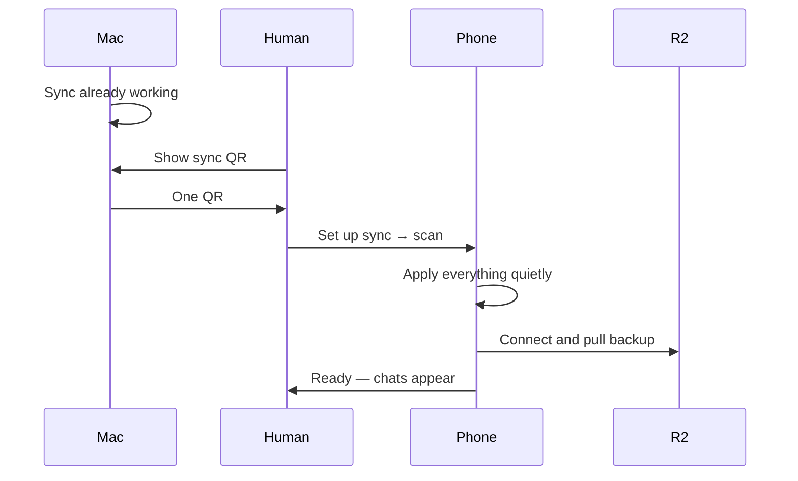

# Plan: One QR to set up sync

> **For agentic workers:** Implement task-by-task. Steps use checkbox (`- [ ]`) syntax for tracking. Prefer small commits per task group unless the user asks otherwise.
>
> **Status:** ACTIVE — implements Consolidation workstream **C4** (sync onboarding). Parent: [2026-07-14-consolidation.md](./2026-07-14-consolidation.md) / [ROADMAP.md](../ROADMAP.md) § v0.8.
>
> **Created:** 2026-07-14  
> **Decision:** Keep R2 as the data plane. No Firebase/auth, no CloudKit, no OpenAI-vs-R2 UX split. Surface a **single sync QR**.

---

## Mental model (product copy)

Users should think: **“Mac shows a QR → phone scans it → we’re synced.”**

They should **not** think: configure Cloudflare, then OpenAI, then sync.

| Surface             | Primary action                 | Secondary (collapsed / advanced) |
| ------------------- | ------------------------------ | -------------------------------- |
| Mac Settings → Data | **Show sync QR**               | Manual R2 fields (already there) |
| Phone Settings      | **Set up sync** (opens camera) | Manual R2 / API key fields       |

Under the hood the QR still carries R2 credentials + OpenAI key. That is an implementation detail, not UI.

## User flow



1. Mac already has R2 + OpenAI set up and has synced at least once (bucket has a bundle).
2. Mac: **Show sync QR**.
3. Phone: **Set up sync** → scan that one QR.
4. Phone saves whatever the payload needs, tests connection, **pulls the backup**, done.
5. Manual credential fields stay available as advanced fallback, not the happy path.

## Architecture options (decided)

| Direction | Status |
|-----------|--------|
| **R2 + Mac→phone QR pairing** (recommended) | **Chosen** |
| CloudKit | Rejected for this phase |
| Thin auth-over-R2 | Rejected |
| Full BaaS (Firebase, etc.) | Rejected |

## Payload (v1) — one blob, always complete

```text
harness-pair:1:<base64url(json)>
```

```json
{
  "v": 1,
  "exp": 1710000000,
  "accountId": "...",
  "bucket": "...",
  "prefix": "harness/",
  "accessKeyId": "...",
  "secretAccessKey": "...",
  "openaiApiKey": "..."
}
```

- **Always include OpenAI key** when present on Mac. No “include API key?” checkbox. If Mac has no OpenAI key, phone still gets R2 and can pull; chat will ask for a key later like today.
- **`exp`:** ~10 minutes. Reject expired / bad version on scan.
- Optional: **Copy sync code** (same string) for AirDrop/Messages — still one blob, not two products.
- No Tavily / extra secrets in v1.

## Security (brief)

QR is a short-lived credential transfer. Copy near the QR: “Contains your sync credentials. Don’t screenshot or share.” Dismiss when Settings closes or when expired. Document in [SECURITY.md](../SECURITY.md).

## Implementation tasks

### Shared payload

- [ ] Define `harness-pair` v1 encode/decode in [`src/shared/pairingPayload.ts`](../src/shared/pairingPayload.ts) (base64url JSON + expiry + version checks).
- [ ] Mirror codec in Swift (iOS) for the same string format.
- [ ] Unit tests: Vitest + Swift — round-trip, reject expired, reject bad version, missing fields.

### Desktop

- [ ] Assemble payload from settings + keychain secrets (credentials IPC; never log secrets).
- [ ] QR render in renderer (`qrcode` or similar).
- [ ] UI: one control **Show sync QR** (Settings → Data) → modal with QR + countdown + **Copy sync code**. No OpenAI toggle.
- [ ] Keep existing manual R2 fields as advanced / secondary.

### iOS

- [ ] One primary control: **Set up sync** (opens camera) — not “Scan for R2” / not a separate OpenAI import in this flow.
- [ ] On successful scan: write R2 settings + Keychain secrets → test connection → **pull backup** → short status (“Synced” / error).
- [ ] Paste-code fallback uses the same single decoder.
- [ ] Advanced section keeps manual R2 / API key editing for power users.
- [ ] Camera permission string: sync setup wording, not “scan R2 barcodes.”

### Docs

- [ ] Update [ios/README.md](../ios/README.md) first-run: Mac configure → Show sync QR → phone Set up sync → done.
- [ ] Document QR credential transfer in [SECURITY.md](../SECURITY.md) (short-lived, don’t screenshot/share).

## Out of scope

- Firebase / auth / CloudKit
- Realtime push
- Encrypting keys inside the R2 bundle
- Phone → Mac QR
- Splitting “pair storage” vs “pair API key” in the UI

## Success criteria

From a working Mac: phone opens **Set up sync**, scans **one** QR, and has conversations without filling OpenAI or R2 forms.

---

*Last updated: 2026-07-14*
