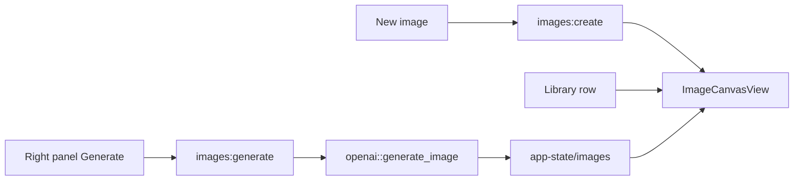

# Plan: Generated images as library objects

> **Archived (shipped).** Landed ~2026-07-12 as v0.7.6 image library. Path updated: companion supersede note now lives beside this file in `plans/archive/`.

**Status:** Shipped / archived  
**Created:** 2026-07-12  
**Supersedes:** `plans/archive/2026-07-09-editor-image-generation.md` (note Insert → Image flow)

---

## Goal

Generated images are a **first-class library object**, peer to chats and notes — not markdown assets embedded in notes.

### Product shape

1. **New ▾ → New image** creates an image object and opens it.
2. **Sidebar** lists images with a distinct icon alongside chats/notes.
3. **Detail view** is a **canvas** (image fills the main area) with a **right controls panel** (prompt, aspect/quality/background/format, Generate / Regenerate).

### Out of scope (v1)

- Inserting generated images into note markdown
- Image edit / inpainting
- Chat `generate_image` tool
- Version history / multi-variant gallery per object
- iOS

---

## Why the prior approach was wrong

The Jul 9 plan treated images as note-scoped assets (`note-assets/{noteId}/`) opened via Editor Insert → floating composer → insert markdown. That makes notes the owner and buries generation inside the editor. Sidebar IA already reserved `kind: "image"` as a library peer; this plan implements that.

**Keep:** OpenAI `generate_image`, option mapping (aspect→size, jpeg/transparent guard), credential gating.  
**Rip:** `note_assets` note-scoped tree, `notes:generateImage`, Insert menu + `NotesImageComposer` floating panel, note-line selection/decoration for assets.

---

## Data model

### Disk (`app-state/`)

| Path | Role |
|------|------|
| `images.json` | Index of image objects |
| `images/{id}.{ext}` | Generated bytes (`png` / `jpeg` / `webp`) |

Index entry fields (camelCase):

```ts
{
  id: string;
  title: string;          // from prompt truncate, else "Untitled image"
  prompt: string;
  createdAt: number;
  updatedAt: number;
  aspect: "auto" | "square" | "landscape" | "portrait";
  quality: "auto" | "low" | "medium" | "high";
  background: "auto" | "opaque" | "transparent";
  outputFormat: "png" | "jpeg" | "webp";
  /** Present after first successful generate; filename only or images/{id}.ext */
  fileName?: string;      // e.g. "{id}.png"
}
```

### Shared types

Move option types off `NoteImage*` → `ImageAspect` etc. in `src/shared/images.ts` (or keep aliases briefly). Rename `noteImageOptions.ts` → `imageOptions.ts`.

### IPC

```ts
images: {
  list(): Promise<GeneratedImage[]>;
  create(): Promise<GeneratedImage>;          // empty shell, no file yet
  read(id: string): Promise<GeneratedImage | null>;
  delete(id: string): Promise<GeneratedImage[]>;
  generate(input: ImageGenerateInput): Promise<GeneratedImage>; // writes/replaces file
}
```

`ImageGenerateInput`: `{ imageId, prompt, aspect, quality, background, outputFormat }`  
`GeneratedImage` includes `absolutePath: string | null` for `convertFileSrc` preview.

---

## UI

### New menu

Add **New image** under New chat / New note (no shortcut required for v1 unless cheap).

### Sidebar

- `LibraryItemKind` += `"image"`
- Merge image summaries into `libraryRows` (`createdAt` = `updatedAt` for sort, same as notes)
- Icon: `Image` (lucide)
- Select → `view = "images"`, `activeImageId = id`
- Delete → `images.delete`

### View: `ImageCanvasView`

Layout:

```
┌─────────────────────────────┬──────────────────┐
│                             │  Prompt          │
│         Canvas              │  Aspect / Qual…  │
│    (centered image or       │  Background/Fmt  │
│     empty placeholder)      │  [Generate]      │
│                             │  error / spinner │
└─────────────────────────────┴──────────────────┘
```

- Empty state before first generate: muted placeholder copy on canvas
- After generate: image scaled to fit canvas (`object-fit: contain`)
- Right panel reuses segmented option controls from the old composer
- Session: `view: "images"`, `imagesOpenImageId`

---

## Architecture



---

## Implementation tasks

### Task 1 — Shared types + options rename

- [ ] Add `src/shared/images.ts` with types + title helper
- [ ] Rename options module to `imageOptions.ts` / `IMAGE_*` exports; update tests
- [ ] Remove `NoteImage*` / asset-line helpers from `writing.ts`

### Task 2 — Rust `images` module

- [ ] Create `src-tauri/src/images.rs` (list/create/read/delete/generate)
- [ ] Register commands; remove `notes_generate_image` + `generate_note_image`
- [ ] Delete `note_assets.rs` and note-delete asset cleanup
- [ ] `cargo test` for index save/delete + path layout

### Task 3 — Frontend API

- [ ] `desktopAPI` / `desktopAdapter` `images.*`
- [ ] IPC name tests for `images:list|create|read|delete|generate`

### Task 4 — `ImageCanvasView` + CSS

- [ ] Canvas + right panel component
- [ ] Styles matching app chrome (not floating notes aside)

### Task 5 — App + Sidebar + session

- [ ] `View` / `UiSessionView` += `"images"`; `imagesOpenImageId`
- [ ] Load images list; New image; select/delete; restore session
- [ ] Rust `ui_session` mirror

### Task 6 — Rip note-embedded UI

- [ ] Remove Insert menu, `NotesImageComposer`, image selection wiring from `WritingSurfaceView`
- [ ] Delete `NotesImageComposer.tsx`, `notesSelectionActions*` if unused
- [ ] Remove insert/composer CSS; optional keep `insertAtCursor` on editor (harmless)

### Task 7 — Verify

- [ ] New image → generate → canvas shows file under `app-state/images/`
- [ ] Sidebar lists/selects/deletes
- [ ] Notes editor has no Insert → Image
- [ ] Unit tests + `cargo test images`

---

## Acceptance

- [ ] New menu includes New image
- [ ] Images appear in sidebar library with distinct icon
- [ ] Opening an image shows canvas + right controls panel
- [ ] Generate/regenerate persists and displays the file
- [ ] No note-tied image composer or `note-assets/` ownership path
